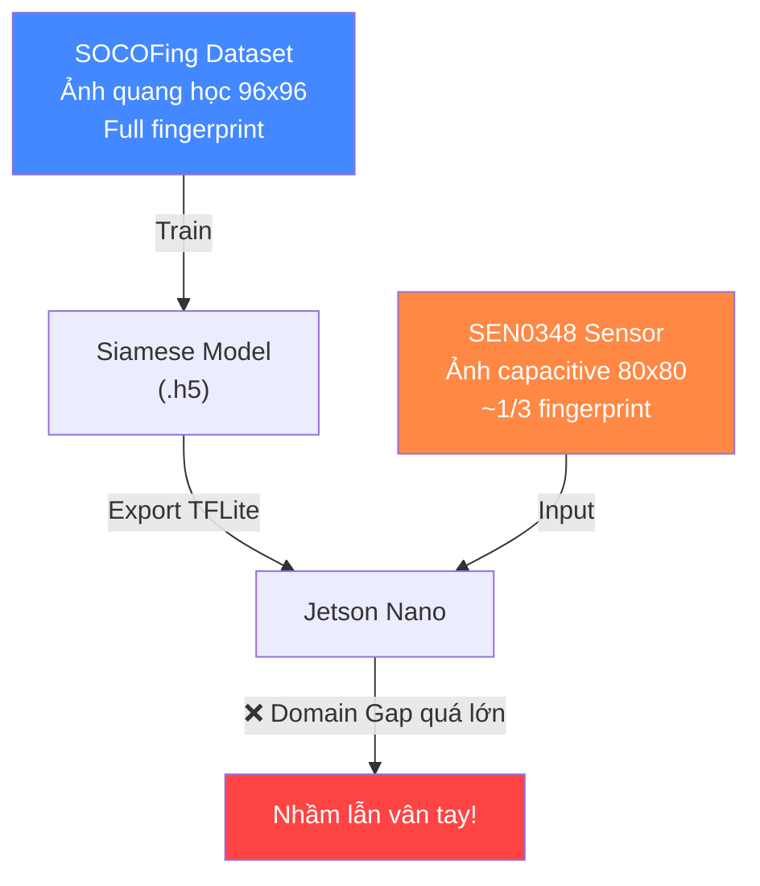
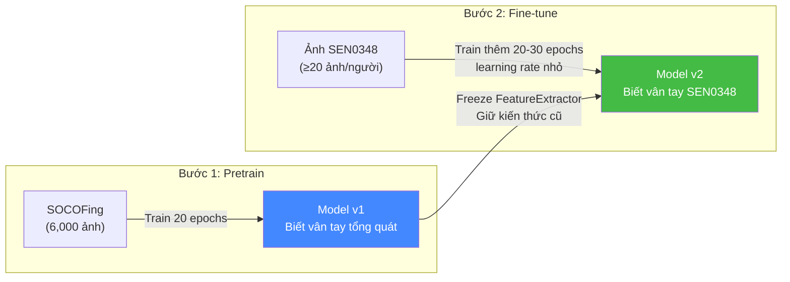
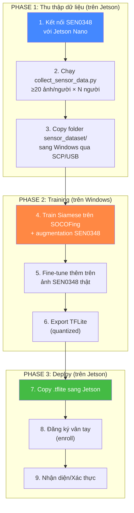

# Triển khai chuẩn chỉnh hệ thống nhận diện vân tay trên Jetson Nano B01

## Tổng quan vấn đề

Hệ thống hiện tại dùng **Siamese Network** train trên bộ SOCOFing (ảnh quang học, full fingerprint) → export TFLite → chạy trên Jetson Nano với cảm biến **SEN0348** (ảnh capacitive, chỉ ~1/3 vân tay). Kết quả: **bị nhầm lẫn vân tay với nhau**.

### Nguyên nhân gốc rễ (Root Cause Analysis)



| Yếu tố | SOCOFing (Train) | SEN0348 (Thực tế) | Tác động |
|---------|-------------------|--------------------|----------|
| **Loại cảm biến** | Quang học (optical) | Điện dung (capacitive) | Contrast, texture hoàn toàn khác |
| **Vùng quét** | Full ngón tay (100%) | ~30-35% ngón tay | Model thấy ít feature hơn → dễ nhầm |
| **Kích thước ảnh** | 96×103 → resize 90×90 | 80×80 → resize 90×90 | Scale factor khác nhau |
| **Nhiễu** | Sạch hoặc bị mờ/xóa | Nhiễu lưới caro (grid noise) | Pattern nhiễu che feature |
| **Chất lượng** | Ảnh rõ nét, full ridge | Mờ, partial, ít chi tiết | Quá ít thông tin để phân biệt |

> [!CAUTION]
> **Đây là vấn đề "Domain Gap"** — model học trên domain A (SOCOFing) nhưng suy luận trên domain B (SEN0348) hoàn toàn khác. Dù code fine-tuning đã có sẵn trong project, nếu chưa thực sự chạy nó với đủ dữ liệu SEN0348 thì model sẽ KHÔNG PHÂN BIỆT được.

---

## Giải thích Fine-tuning

> [!NOTE]
> **Fine-tuning là gì?** Là kỹ thuật lấy model đã train sẵn (pretrained) trên bộ dữ liệu lớn, rồi **train thêm một ít** trên bộ dữ liệu mục tiêu (target) để model "thích nghi" với dữ liệu thực tế.



**Tại sao cần fine-tune?**
1. **Giữ kiến thức gốc**: Model đã biết "vân tay trông như thế nào" từ SOCOFing
2. **Thích nghi domain mới**: Chỉ cần ít dữ liệu SEN0348 (~20-30 ảnh/người × 3-5 người) để model học cách xử lý ảnh capacitive partial
3. **Freeze FeatureExtractor**: Đóng băng các layer trích đặc trưng → chỉ train các layer so sánh → tránh quên kiến thức cũ

**Khi nào `--no-freeze`?** Nếu fine-tune với freeze mà kết quả vẫn kém, thử `--no-freeze` để mở khóa toàn bộ layers → model sẽ học sâu hơn nhưng cần nhiều dữ liệu hơn.

---

## User Review Required

> [!IMPORTANT]
> **Bạn cần xác nhận chiến lược trước khi tôi bắt tay code:**
> 
> Hiện tại project của bạn đã có gần đầy đủ code cần thiết. Vấn đề chính là **quy trình vận hành** (workflow) chưa đúng. Dưới đây tôi đề xuất 2 phương án:

### Phương án A: Fine-tune trên Jetson (Khuyến nghị — ít thay đổi code nhất)
- Dùng code hiện có (`collect_sensor_data.py` → `finetune_sensor.py`)
- Thu thập ảnh SEN0348 trên Jetson → fine-tune ngay trên Jetson
- **Ưu**: workflow đơn giản, code gần như đã sẵn
- **Nhược**: Jetson Nano B01 chỉ có 4GB RAM → fine-tune chậm, có thể OOM

### Phương án B: Train lại hoàn toàn trên Windows với ảnh SEN0348 (Mạnh hơn)
- Thu thập ảnh SEN0348 trên Jetson → copy sang Windows
- Trộn ảnh SEN0348 vào pipeline training (cùng với hoặc thay thế SOCOFing)
- Train lại Siamese model trên Windows → export TFLite → copy sang Jetson
- **Ưu**: Tận dụng GPU mạnh trên PC, train nhanh và chính xác hơn
- **Nhược**: Cần sửa pipeline training, workflow phức tạp hơn

### Phương án C: Kết hợp A + B (Tốt nhất)
1. Train trên Windows với SOCOFing + augmentation mạnh mô phỏng SEN0348
2. Copy ảnh SEN0348 sang Windows → fine-tune trên Windows
3. Export TFLite → deploy Jetson
4. Nếu cần → fine-tune thêm trên Jetson khi có người dùng mới

---

## Open Questions

> [!IMPORTANT]
> 1. **Bạn có GPU trên máy Windows không?** (NVIDIA GPU → dùng TensorFlow-GPU sẽ nhanh hơn nhiều)
> 2. **Bạn cần nhận diện bao nhiêu người?** (Ảnh hưởng đến số lượng ảnh cần thu thập)
> 3. **Bạn đã thu thập ảnh từ SEN0348 bao giờ chưa?** (Đã có folder `sensor_dataset/` trên Jetson chưa?)
> 4. **Bạn muốn tôi sửa code theo phương án nào (A, B, hay C)?**

---

## Proposed Changes (Phương án C — đề xuất mặc định)

### Tổng quan quy trình mới



---

### Component 1: Training Pipeline (Windows)

#### [MODIFY] [run_pipeline.py](file:///c:/1.University/4.Note/27.Proximity/Jet-SEN-Py/fingerprint_recognition/Tiny-Fingerprint_Recognition/scripts/run_pipeline.py)

Thêm **Phase 2: Fine-tune tự động trên ảnh SEN0348** sau khi train trên SOCOFing:
- Kiểm tra nếu tồn tại folder `sensor_dataset/` → tự động fine-tune
- Nếu chưa có → chỉ train SOCOFing + augmentation và nhắc nhở thu thập

#### [NEW] `scripts/finetune_on_pc.py`

Script fine-tune trên Windows (mạnh hơn `jetson/finetune_sensor.py`):
- Load model `.h5` đã train
- Load ảnh SEN0348 từ `sensor_dataset/`
- Áp preprocessing giống y hệt inference (FFT denoise + CLAHE)
- Fine-tune với learning rate nhỏ (1e-4 → 1e-5)
- Export TFLite mới
- **Thêm validation split** để đánh giá accuracy trước khi deploy

#### [NEW] `scripts/evaluate_model.py`

Script đánh giá model trước khi deploy:
- Test model trên tập ảnh SEN0348 held-out
- In confusion matrix, FAR/FRR
- So sánh model trước/sau fine-tune

---

### Component 2: Data Collection (Jetson)

#### [MODIFY] [collect_sensor_data.py](file:///c:/1.University/4.Note/27.Proximity/Jet-SEN-Py/jetson/collect_sensor_data.py)

Cải thiện:
- Thêm `--preview` mode: hiển thị ảnh sau mỗi lần chụp (kiểm tra chất lượng)
- Thêm `--augment` flag: tự động augment mỗi ảnh x3-5 lần (xoay, dịch) → tăng dataset
- Thêm kiểm tra chất lượng ảnh (variance check → bỏ ảnh quá mờ/đen)

---

### Component 3: Inference Engine (Jetson)

#### [MODIFY] [inference.py](file:///c:/1.University/4.Note/27.Proximity/Jet-SEN-Py/jetson/inference.py)

Sửa lỗi tiềm ẩn trong `_set_inputs`:
- Hiện tại gán input theo thứ tự `[0]`, `[1]` → **có thể bị đảo** khi TFLite convert
- Sửa: gán input theo **tên tensor** (`serving_default_input_1:0`, `serving_default_input_2:0`)

#### [MODIFY] [config.py](file:///c:/1.University/4.Note/27.Proximity/Jet-SEN-Py/jetson/config.py)

- Tăng `MATCH_THRESHOLD` từ 0.5 → 0.65 (sau khi fine-tune, ngưỡng cần cao hơn)
- Thêm config `PREPROCESS_ENROLLED = True` → preprocess ảnh enrolled 1 lần khi load cache

---

### Component 4: Siamese Model Architecture

#### [MODIFY] [classifiers.py](file:///c:/1.University/4.Note/27.Proximity/Jet-SEN-Py/fingerprint_recognition/Tiny-Fingerprint_Recognition/fingerprint_ids/models/classifiers.py)

Model hiện tại rất đơn giản (chỉ 2 Conv layers). Đề xuất tăng cường:
- Thêm **Dropout** giữa các layers (giảm overfitting)
- Thêm **BatchNormalization** (ổn định training)
- Tăng depth lên 3 Conv blocks (capture thêm features)
- **Giữ model nhỏ** vì phải chạy trên Jetson Nano (4GB RAM)

---

## Hướng dẫn đặt tên ảnh SEN0348 trong dataset

> [!NOTE]
> **Bạn KHÔNG nên đưa ảnh SEN0348 vào folder SOCOFing** (Real/Altered). Vì format tên file khác nhau hoàn toàn và ảnh SEN0348 chỉ là partial fingerprint, trộn vào sẽ gây confuse cho loader.

### Cấu trúc dataset SEN0348 đúng cách:

```
sensor_dataset/                    ← Folder riêng cho ảnh SEN0348
├── person_001/                    ← Người 1 (ví dụ: Bạn)
│   ├── sample_0.bmp              ← Lần quét 1
│   ├── sample_1.bmp              ← Lần quét 2
│   ├── ...
│   └── sample_19.bmp             ← Lần quét 20 (tối thiểu 20)
├── person_002/                    ← Người 2
│   ├── sample_0.bmp
│   └── ...
├── person_003/                    ← Người 3
│   └── ...
└── ... (≥3 người để model học phân biệt)
```

**Quy tắc đặt tên:**
- Folder: `person_XXX` (XXX = số ID, ví dụ: 001, 002, ...)
- File: `sample_N.bmp` (N = số thứ tự, bắt đầu từ 0)
- Format ảnh: **BMP grayscale 80×80** (SEN0348 tự xuất)
- Tối thiểu: **20 ảnh/người × 3 người = 60 ảnh**
- Khuyến nghị: **30 ảnh/người × 5 người = 150 ảnh**

**Khi quét**: Mỗi lần quét, đặt ngón tay ở vị trí hơi khác nhau (xoay nhẹ, dịch lên/xuống) → tăng đa dạng.

---

## Verification Plan

### Automated Tests

1. **Unit test model architecture**:
   ```bash
   # Trên Windows
   python -c "from fingerprint_ids.models.classifiers import build_siamese_model; m = build_siamese_model(); m.summary()"
   ```

2. **Test TFLite export**:
   ```bash
   python export_for_jetson.py --model result/fingerprint_siamese_model.h5
   # Kiểm tra output: Input/Output shape, dtype
   ```

3. **Test inference trên Jetson** (sau khi deploy):
   ```bash
   python3 -c "
   from inference import FingerprintEngine
   engine = FingerprintEngine()
   import numpy as np
   # Tạo 2 ảnh giả để test pipeline
   img1 = np.random.randint(0, 255, (80, 80), dtype=np.uint8)
   img2 = img1.copy()  # Same image → score phải cao
   score, match, ms = engine.compare(img1, img2)
   print(f'Self-compare: score={score:.4f}, match={match}, time={ms:.1f}ms')
   assert score > 0.5, 'Self-compare score too low!'
   "
   ```

### Manual Verification

1. **Thu thập ≥60 ảnh SEN0348** (3 người × 20 ảnh)
2. **Fine-tune** và so sánh accuracy trước/sau
3. **Test trên Jetson**: đăng ký 3 người → nhận diện → kiểm tra không nhầm lẫn
4. **Test case negative**: đặt ngón tay chưa đăng ký → phải ra "KHÔNG NHẬN DIỆN ĐƯỢC"

---

## Bước tiếp theo

Sau khi bạn xác nhận phương án, tôi sẽ:
1. Sửa code training pipeline + model architecture
2. Tạo script fine-tune trên PC (`finetune_on_pc.py`)
3. Tạo script evaluate (`evaluate_model.py`)
4. Sửa inference engine (fix input mapping)
5. Cập nhật config + tài liệu hướng dẫn step-by-step
